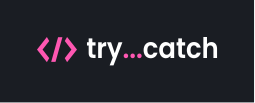

# Try...catch - Blog

## Getting Started

Storybook Deploy

- [https://try-catch-storybook.vercel.app/](https://try-catch-storybook.vercel.app/)

## Available Scripts

### Running the development server.

```bash
    yarn dev
```

### Building for production.

```bash
    yarn build
```

### Running the production server.

```bash
    yarn start
```

### Running the Storybook server.

```bash
    yarn storybook
```

## License

MIT

<div id="top"></div>
<!--
*** Thanks for checking out the Best-README-Template. If you have a suggestion
*** that would make this better, please fork the repo and create a pull request
*** or simply open an issue with the tag "enhancement".
*** Don't forget to give the project a star!
*** Thanks again! Now go create something AMAZING! :D
-->

<!-- PROJECT SHIELDS -->
<!--
*** I'm using markdown "reference style" links for readability.
*** Reference links are enclosed in brackets [ ] instead of parentheses ( ).
*** See the bottom of this document for the declaration of the reference variables
*** for contributors-url, forks-url, etc. This is an optional, concise syntax you may use.
*** https://www.markdownguide.org/basic-syntax/#reference-style-links
-->

[![Forks][forks-shield]][forks-url]
[![Stargazers][stars-shield]][stars-url]
[![MIT License][license-shield]][license-url]
[](https://github.com/rafae2k/try-catch-blog/actions/workflows/main.yml)
[](https://github.com/rafae2k/try-catch-blog/actions/workflows/codeql-analysis.yml)

<!-- PROJECT LOGO -->
<br />
<div align="center">
  <a href="https://github.com/rafae2k/try-catch-blog">
    
  </a>
    </br>
    </br>

  <p align="center">
    Try catch born as personal tutorials blog were i share my knowledge and tips about frontend development
    <br />
    <br />
    <a href="http://try-catch-blog.vercel.app/">View Live</a>
    ·
    <a href="https://github.com/rafae2k/try-catch-blog/issues">Report Bug</a>
    ·
    <a href="https://github.com/rafae2k/try-catch-blog/issues">Request Feature</a>
  </p>
</div>

<!-- TABLE OF CONTENTS -->
<details>
  <summary>Table of Contents</summary>
  <ol>
    <li>
      <a href="#about-the-project">About The Project</a>
      <ul>
        <li><a href="#built-with">Built With</a></li>
      </ul>
    </li>
    <li>
      <a href="#getting-started">Getting Started</a>
      <ul>
        <li><a href="#prerequisites">Prerequisites</a></li>
        <li><a href="#installation">Installation</a></li>
      </ul>
    </li>
    <li><a href="#usage">Usage</a></li>
    <li><a href="#roadmap">Roadmap</a></li>
    <li><a href="#contributing">Contributing</a></li>
    <li><a href="#license">License</a></li>
    <li><a href="#contact">Contact</a></li>
  </ol>
</details>

<!-- ABOUT THE PROJECT -->

## About The Project

[![Product Name Screen Shot][product-screenshot]](https://try-catch-blog.vercel.app/)

<p align="right">(<a href="#top">back to top</a>)</p>

### Built With

This blog was build with JAMstack architecture, fast, reliable and SEO focused.

- [Next.js](https://nextjs.org/)
- [React.js](https://reactjs.org/)
- [Prismic CMS](https://prismic.io/)
- [Styled Components](https://styled-components.com/)
- [Framer Motion](https://www.framer.com/motion/)
- [Storybook](https://storybook.js.org/)
- [Jest](https://jestjs.io/)

<p align="right">(<a href="#top">back to top</a>)</p>

<!-- GETTING STARTED -->

## Getting Started

Vercel Blog Deploy

- [https://try-catch-blog.vercel.app/](https://try-catch-blog.vercel.app/)

Storybook Deploy

- [https://try-catch-storybook.vercel.app/](https://try-catch-storybook.vercel.app/)

### Prerequisites

This project use `yarn` as package manager, you can still use others managers as `npm`.

To enable `yarn` follow this steps.

- yarn
  ```sh
  corepack enable
  ```

### Installation

1. Clone the repo
   ```sh
   git clone https://github.com/rafae2k/try-catch-blog
   ```
2. Install NPM packages
   ```sh
   yarn install
   ```
3. run dev server
   ```sh
   yarn dev
   ```
4. Running the Storybook server
   ```bash
   yarn storybook
   ```

<p align="right">(<a href="#top">back to top</a>)</p>

<!-- ROADMAP -->

## Roadmap

- [x] Connect github social login
- [x] Add Dark/Light Theme
- [x] Add custom-types SliceMachine (Prismic CMS)
- [x] Add comments sections with [utterances](https://github.com/utterance/utterances)
- [x] Multi-language Support - i18y
  - [x] Portuguese (pt-BR)
  - [x] English (en-US)
- [ ] Fix Next-Image component
- [ ] Tweek framer motion and header auto-hide on Mobile devices
- [ ] Write 100 posts.

See the [open issues](https://github.com/rafae2k/try-catch-blog/issues) for a full list of proposed features (and known issues).

<p align="right">(<a href="#top">back to top</a>)</p>

<!-- CONTRIBUTING -->

## Contributing

Contributions are what make the open source community such an amazing place to learn, inspire, and create. Any contributions you make are **greatly appreciated**.

If you have a suggestion that would make this better, please fork the repo and create a pull request. You can also simply open an issue with the tag "enhancement".
Don't forget to give the project a star! Thanks again!

1. Fork the Project
2. Create your Feature Branch (`git checkout -b feature/AmazingFeature`)
3. Commit your Changes (`git commit -m 'Add some AmazingFeature'`)
4. Push to the Branch (`git push origin feature/AmazingFeature`)
5. Open a Pull Request

<p align="right">(<a href="#top">back to top</a>)</p>

<!-- LICENSE -->

## License

Distributed under the MIT License. See `LICENSE.txt` for more information.

<p align="right">(<a href="#top">back to top</a>)</p>

<!-- CONTACT -->

## Contact

- Twitter [@hm_rafo](https://twitter.com/hm_rafo)
  <br>
- Email <a href="mailto:hello@rafo.work">hello@rafo.work</a>

<p align="right">(<a href="#top">back to top</a>)</p>

<!-- MARKDOWN LINKS & IMAGES -->
<!-- https://www.markdownguide.org/basic-syntax/#reference-style-links -->

[forks-shield]: https://img.shields.io/github/forks/rafae2k/try-catch-blog.svg?style=for-the-badge
[forks-url]: https://github.com/rafae2k/try-catch-blog/fork
[stars-shield]: https://img.shields.io/github/stars/rafae2k/try-catch-blog.svg?style=for-the-badge
[stars-url]: https://github.com/rafae2k/try-catch-blog/stargazers
[issues-shield]: https://img.shields.io/github/issues/rafae2k/try-catch-blog.svg?style=for-the-badge
[issues-url]: https://github.com/rafae2k/try-catch-blog/issues
[license-shield]: https://img.shields.io/github/license/rafae2k/try-catch-blog.svg?style=for-the-badge
[license-url]: https://github.com/rafae2k/try-catch-blog/blob/main/LICENSE.txt
[product-screenshot]: docs/assets/docs-trycatch.gif
